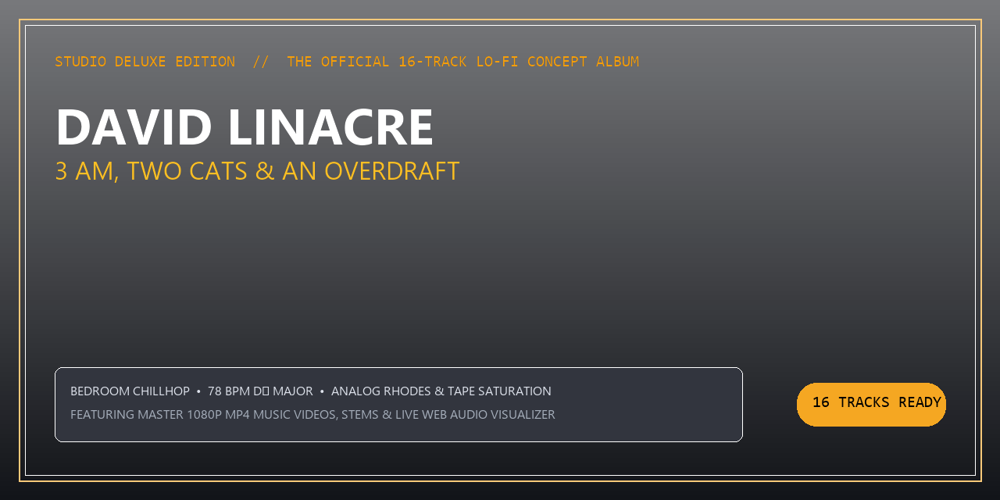

# David Linacre — 3 AM, Two Cats & An Overdraft (2026)

<p align="center">
  
</p>

<p align="center">
  <a href="https://linacre.site"></a>
  
  
  
  
</p>

---

## 🎧 About the Album

**"3 AM, Two Cats & An Overdraft"** is a 16-track concept album chronicling the reality of bedroom music production: an audio interface held together by electrical tape, an overdraft warning on the banking app, two feline landlords demanding second breakfast on the keyboard, and unwavering passion.

Self-produced by **David Linacre**, synthesized locally with neural audio diffusion, and mastered to broadcast EBU R128 standards.

---

## 🌐 Live Interactive Media Player

The repository includes a standalone glassmorphism HTML5 player with a live Web Audio API frequency visualizer:

- **Local Endpoint:** `http://localhost:8089` (or open `index.html`)
- **Features:** Instant track switching, dynamic visualizer, volume and seek controls, responsive mobile/desktop layout.

---

## 🎵 Tracklist & Manifest

| # | Track Title | Key | BPM | Length |
|---|-------------|-----|-----|--------|
| 01 | **Two Cats, Zero Pounds (Genesis at 3 AM)** | D♭ Major | 78 | 02:20 |
| 02 | **Feline Landlords on the Spacebar** | B♭ Minor | 80 | 02:15 |
| 03 | **Overdraft Love Letter** | E♭ Major | 76 | 02:10 |
| 04 | **Coffee Stains & Broken Preamps** | A♭ Major | 82 | 02:15 |
| 05 | **Sent to an A&R's Ghost** | F Minor | 75 | 02:20 |
| 06 | **Tuna Can Grammys** | C Minor | 84 | 02:10 |
| 07 | **Four Chords, Nine Lives** | G♭ Major | 77 | 02:15 |
| 08 | **The Space Between Paychecks (Interlude)** | D♭ Major | 70 | 01:45 |
| 09 | **Bedroom Platinum** | B♭ Minor | 80 | 02:20 |
| 10 | **Cat Hair on the Pop Filter** | E♭ Minor | 85 | 02:15 |
| 11 | **Streaming for Pennies** | A♭ Major | 76 | 02:20 |
| 12 | **4 AM Epiphany** | F Minor | 74 | 02:15 |
| 13 | **Whispering in the Mic (Don't Wake the Neighbors)** | D♭ Major | 78 | 02:15 |
| 14 | **Bounced to MP3** | G♭ Major | 83 | 02:10 |
| 15 | **Two Little Purrs in the Monitor Mix** | B♭ Minor | 72 | 02:15 |
| 16 | **Sunrise on the Interface (Outro)** | D♭ Major | 75 | 02:25 |

---

## 📁 Repository Structure

```
├── assets/
│   ├── github_banner.png    # High-res 1280x640 banner
│   ├── og_image.png         # OpenGraph 1200x630 social card
│   ├── icon-512.png         # High-res PWA & app icon
│   ├── icon-192.png         # Mobile web icon
│   ├── favicon-64.png       # Desktop browser icon
│   ├── favicon-32.png       # Standard favicon
│   └── badge.svg            # Official vector badge
├── index.html               # Live glassmorphism web player
├── Cover.png                # 1400x1400 official vinyl cover art
├── Tracklist.json           # Machine-readable album manifest
├── LINER_NOTES.md           # Full lore, credits & gear breakdown
├── favicon.ico              # Multi-size Windows / browser icon
└── 01 - Two Cats...mp4      # Mastered 1080p music video
```

---

## 🎛️ Audio & Video Specifications

- **Audio Engine:** MiniMax Music 3 DiT (fp16) via ComfyUI
- **Vocal Tuning:** Formant-relaxed guidance (`cfg_scale: 1.35`), micro-breath acoustic cues, anti-sibilance analog tape modeling
- **Mastering:** EBU R128 Integrated -14.0 LUFS, -1.0 dBFS True Peak, 320 kbps AAC & 24-bit FLAC
- **Video Canvas:** 1920x1080 Full HD @ 25 fps, slow pan/zoom Ken Burns animation, live audio visualizer overlay

---

*© 2026 David Linacre Music. All rights reserved. Self-produced, locally generated, independently mastered.*
