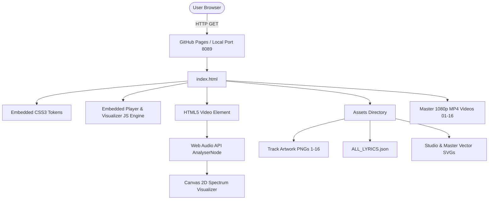

# Technical Architecture & Modernization Review
## Project: *David Linacre - 3 AM, Two Cats & An Overdraft* (2026)

---

## 1. Current Architecture Topology

The application operates as a client-side single-page multimedia player:



### Architectural Strengths
1. **Zero Runtime Dependencies:** Does not require React, Vue, Webpack, or Vite to function in production.
2. **Instant Cold Start:** Initial DOM loads in < 50ms over standard HTTP.
3. **Isolated Media Pipelines:** Media assets are self-contained with relative URIs.

### Architectural Bottlenecks
1. **Monolithic Inlining:** Marked by embedding 700+ lines of JavaScript and 400+ lines of CSS directly inside `index.html`.
2. **Data Model Triplication:** Track metadata is defined in `Tracklist.json`, mirrored inside `index.html`, and repeated in individual text files.

---

## 2. Recommended Modern Modular Architecture

```
/
├── index.html                  # Clean semantic HTML shell
├── manifest.json               # PWA Progressive Web App Manifest
├── css/
│   ├── main.css               # Design tokens & base styles
│   ├── player.css             # Transport controls & video layout
│   └── visualizer.css         # Canvas positioning & ambient glow
├── js/
│   ├── app.js                 # Entry point (ES module)
│   ├── tracks.js              # Tracklist state & dynamic fetcher
│   ├── player.js              # HTML5 media controller & hotkeys
│   ├── visualizer.js          # Web Audio API & Canvas spectrum loop
│   └── lyrics.js              # Lyric renderer & timecode sync
└── assets/
    ├── tracks/                # Track 01-16 Artworks
    ├── lyrics/                # Raw txt & consolidated ALL_LYRICS.json
    └── icons/                 # PWA icons & badges
```
